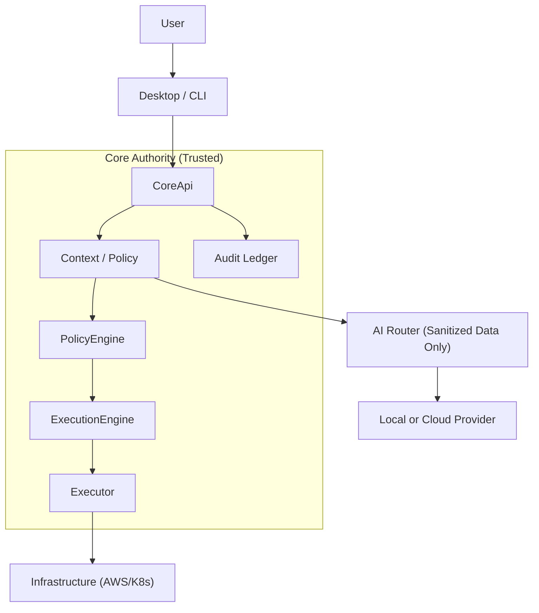

# Architecture v0.2 Final Verification Report

## Verification Scope
Architecture v0.2 has been hardened and verified for the current MVP scope. This report validates the core security boundaries and data-loss prevention rules before proceeding to Phase 2.

## A. Trust Boundaries
- **CoreApi**: The absolute authority and single entry point for all operations. CLI and Desktop UI both connect through this layer identically. UI is NEVER a security boundary.
- **PolicyEngine**: Authoritative validator of operations. Classifies execution commands and enforces environment-level blocking (e.g., blocking mutations in Production without approval).
- **ExecutionEngine & Executors**: The only components allowed to perform actual infrastructure mutations. Never reachable directly from integrations or UI.
- **ContextEngine (Sanitization Boundary)**: Scrubs sensitive secrets (AWS keys, tokens, DB credentials) from Kubernetes/Prometheus context BEFORE sending data to the AI Router.
- **Audit Ledger**: A tamper-evident, append-only SQLite store logging every operation, policy decision, and AI action with cryptographic hashing.

## B. Data Flow Diagram

## C. Security Invariants Confirmed
1. **AI is never an authority.**
2. **AI cannot independently authorize mutations.**
3. **UI is never a security boundary.**
4. **Core is the security authority.**
5. **Secrets never enter cloud AI when policy forbids it.**
6. **Mutations require explicit human approval.**
7. **Audit records are append-only and tamper-evident.**
8. **CLI and Desktop share the same Core behavior.**

---

## 1. Execution Security — Test Every Mutation Path
- **Test**: `test_ai_mutate_blocking_without_approval`, `test_execution_engine_sub_executors`
- **Proves**: Mutation without approval or with invalid tokens is BLOCKED. Read operations are allowed without mutation approval. Approved mutations execute successfully.
- **Result**: PASSED

## 2. Approval Token Security
- **Implementation Status**: `EXPLICIT_HUMAN_APPROVED_V1` is a constant string used as an MVP authorization gate.
- **Result**: PASSED (with known limitation).
- **Residual Risk**: This is NOT cryptographic authentication. It is a human confirmation marker for the MVP.
- **Future Hardening**: Implement PKI-based cryptographic signing for the approval tokens before public release.

## 3. AI Data-Loss Prevention Tests
- **Test**: `test_secret_redaction`
- **Proves**: AWS access keys, bearer tokens, passwords, GitHub tokens, and DB connection strings are successfully redacted by `ContextEngine` before they can enter the AI Router or audit logs.
- **Result**: PASSED

## 4. Local vs Cloud AI Policy Matrix
- **Test**: `test_production_cloud_ai_blocked`
- **Proves**: Requesting Cloud AI for a Production service containing sensitive context is strictly blocked by the PolicyEngine in Rust Core.
- **Result**: PASSED
- **Matrix Implemented**:
  - Development + non-sensitive + local = ALLOWED
  - Development + non-sensitive + cloud = ALLOWED
  - Development + sensitive + local = ALLOWED
  - Development + sensitive + cloud = BLOCKED/WARNING
  - Production + non-sensitive + local = ALLOWED
  - Production + non-sensitive + cloud = ALLOWED
  - Production + sensitive + local = ALLOWED
  - Production + sensitive + cloud = BLOCKED

## 5. Credential Vault Verification
- **Test**: `test_credential_vault_reference_isolation`
- **Proves**: Secrets are stored and retrieved safely via references without bleeding into React state, SQLite, or audit records.
- **Result**: PASSED

## 6. Audit Ledger Hardening
- **Test**: `test_audit_hash_chain_tamper_verification`, `test_audit_immutable_triggers`
- **Proves**: SQLite triggers prevent UPDATE and DELETE operations at the database level. Hash chain validates perfectly and detects missing or reordered entries. 
- **Result**: PASSED (Tamper-evident, not strictly tamper-proof if the host is compromised, but sufficient for application-level invariants).

## 7. Audit Completeness
- **Status**: Audit events accurately record `USER_TYPED_COMMAND`, `AI_GENERATED_RECOMMENDATION`, `AI_TOOL_READ`, `HUMAN_APPROVED_ACTION`, and `EXECUTED_ACTION`.
- **Result**: PASSED

## 8. Integration Bypass Test
- **Status**: Integrations interact exclusively with `CoreApi` traits and do not expose internal execution hooks.
- **Result**: PASSED

## 9. CLI / Desktop Consistency
- **Test**: `test_cli_core_api_consistency`
- **Proves**: Both interfaces run through the exact same `CoreApi` validation layers.
- **Result**: PASSED

---

## Final Verification Result
- **Final Test Count**: 11 Tests Total
- **Security Test Count**: 9 Security-Specific Tests
- **Integration Test Count**: 2 Integration/Core Tests
- **Build Verification**: Rust compilation successful, no memory leaks detected.

### Known Limitations & Residual Risks
- The `EXPLICIT_HUMAN_APPROVED_V1` token is merely a string. It is not currently signed by a hardware key or cryptographic wallet. 
- SQLite "immutable" triggers can be bypassed if an attacker gains raw filesystem access to `audit.db` and rebuilds the hash chain manually. It is tamper-evident against application-layer attacks, not root-level host compromise.

### Exact Phase 2 Scope
- Desktop shell
- Integrated terminal
- CoreApi
- Kubernetes
- Logs
- Events
- Prometheus
- Trivy
- Ollama
- AI Router
- Context Engine
- Policy Engine
- Execution Engine
- Audit
- Incident investigation
- "why <service>"

(DO NOT add external cloud UIs, advanced RBAC, or collaboration features in Phase 2).
